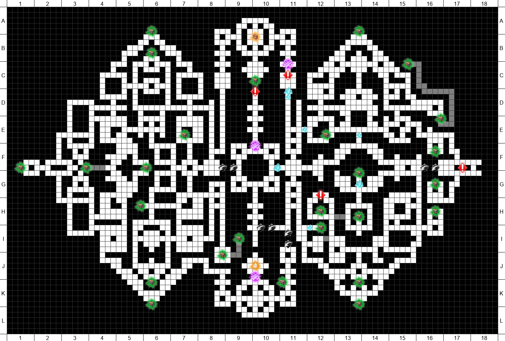

# Touhou Labyrinth Tri Utilities

This is a collection of tools, scripts and other miscellaneous things that I'm using to analyze game data. It ranges from scripts to generate maps, to text files explaining save data format, and a bunch of other stuff. I'll try to keep the README up-to-date with what is where, we'll see how that goes.

## Save data format analysis

### Filename: saves/format.txt

A text file detailing the format used in every file in the save directory. A lot of details are still missing, likely from the limited scope of the demo we have. Some bytes seem to always have some value, others are always zero and don't do anything. Everything that seems affected by the demo's scope has been mapped, however. This includes event flags and flags associated with the current mechanics, even if some details don't seem to work, like Alice's subequip dupes having a 2nd and 3rd slot that are not functional.

### Filename: saves/diff.py

This is a little script I made to help map out the event flags and the misc game data in the PGD file. It takes the files from the latest two directories it sees and compares the flags / data in them, presenting to you the results. It has some toggles to print full data too, for initial analysis. The basic flow was along the lines of:

- Start game, save on slot 5
- Copy save to a directory `001-initial-save`
- Play for a bit, save on slot 5
- Copy save to a directory `002-something-else`
- Run the script, it'll diff the two save files
- Based on the diff, map the changes to actions taken in-game

I ended up adding a little structure to ignore some data that was already mapped, since for example play time in seconds will change every time there's a new save, and I don't want that on my diff every time.

### Filename: unlock-all.py

This is another little script that will take a save file and max out some data in it. You can control some toggles, others are always there. Here's a list of what it does:

- Fully unlocks map data
- All characters unlocked
- All characters to level 100
- All characters unlock all skills from their personal tree
- All characters at +5 main equip [configurable]
- Unlocks all items
- All subequips at +10 upgrades [configurable]
- Have 255 copies of every item
- Have a lot of money [configurable]

## Map data analysis and Map generation

### Filename: map-data.txt

This file explains how the maps are structured in the game, and what each file means. The B file still contains unknown data, any help in understanding what things mean is appareciated.

### Filename: maps/map_render_txt.py

A script that will render the map files into a 150x150 ASCII grid, for visual analysis over how things are laid out. Helped a lot with initial guesswork over which information was which.

### Filename: maps/map_render_img.py

A script that will render the map files into a PNG image, rendering the grid with row/column labels and color-coding hidden paths. It will also read images from the `assets` directory, to render icons on top of the map, mimicking the way the map is presented to the player in-game. An example of the generated map for Forest of Oblivion's 1F:



### Filename: maps/map_render_visual.py

An alternative version of the map render script that will render the map as seen in-game, using the same artwork found in the game. It currently does not work properly, as my attention was focused on the 2D grid script to put them in the Touhou wiki. The main issue is figuring out how the game levels tiles with different heights - I tried some automatic solutions but they all failed, and picking out height offsets manually is a pain, so I kinda abandoned it for now.

### Filename: treasures.txt

A list of treasures available in each floor, along with their coordinates. Mainly there for reference in other scripts / info texts.

## Skills and Spells analysis

### Filename: targets.txt

This file documents the existing targetting modes the enemy AI can use. Not to be confused with the targetting mode of spells (single target, row target, etc), which are assigned to a spell instead of the AI. It follows the same idea from previous games, with a mode to target left slot more frequently, one to target the leftmost character always, etc.

## Break Item Recipes

### Filenames: break-items/names.txt, break-items/recipe-edges.csv, break-items/chart.md

These files just hold the static data found in-game, in different formats. A list of names, a CSV containing the edges of the recipe graph, and a mermaid chart showing how the recipes chain together. By themselves they are really hard to parse through to reach a meaningful conclusion, so I'll probably make some script to generate easier-to-read charts and other useful info.

## DxEncrypt key generator from password

### Filename: dxkey.py

This will generate the encryption key used by old versions of DxEncrypt, given a known password. The password was easy enough to datamine from the exe, so I gave it a shot but the DxExtract tool failed to decrypt the files no matter what. Turns out Tri is using a newer version of DxLib, so I had to download the DxEncrypt / DxDecrypt tools from their site and figure out the command to decrypt it using a known password. For reference, the command for extracting the BGM data should be:

```cmd
DxaDecode.exe -K:HyperGigaAnalSmasher bgm1.dxa
```

Yes, that is the password 3peso chose. It gets worse, the password for his non-Touhou game "Arcanum Knights" was "LegendOfAnal".

## TODO

Here's a non-exhaustive list of things I still want to look for, in no particular order:

- Map out treasure chest event flags so we know which is which
  - Currently I only know which flags exist
- Make a script to better analyze break item recipes, like how many base items are needed for each other item, in total, etc
- Figure out how the game decides which enemies spawn on a random encounter, map out the rare enemy spots and any horde spots / odds
- Fix the script that renders a fully graphical map of each floor, as seen in-game
- Figure out how Cirno adds items to her shop and how the heck she decides to price them
- Figure out how Alice's workshop timer works, how it's decreased with battles and steps
- Map out skill and spell IDs to ease code analysis
- Map out enemy AI to figure out targetting patterns and quirks with the random encounters
- Patch out damage variance to ease testing reliability of skills
- Figure out the accuracy formula, is it the same from 2?
- Map out details of the item drop system, specifically if the hidden bonus from 2 still exists in some way
- The game lists Mersenne Twister in the licenses, the same PRNG used in Pokemon Gen 4+. Can RNG be manipulated in some way like it can be in those games?
- Write a save editor similar to the existing one for 2
  - I should probably finish the backlog for that before porting it over to Tri lol
