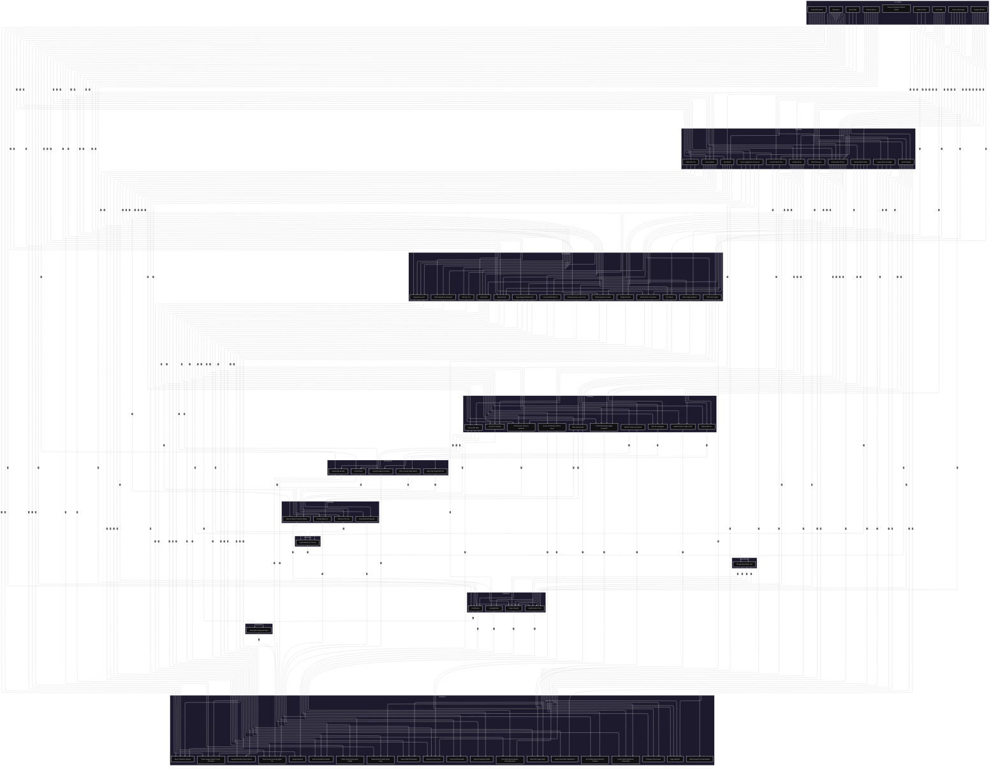

# Items that cannot be crafted

- (1) Mild Herbs
- (2) Beast Meat
- (3) Tasty Wild Greens
- (4) Fresh Milk
- (5) Sleepy Cliff Salt
- (6) Fresh-Looking Egg
- (7) Colorful Berries
- (8) Golden Grains
- (26) Sweet & Fragrant Pressed Violets

# Items that are not used for crafting

- (20) Royal Fruit Ensemble
- (25) Soft Grilled Honey Mustard Chicken
- (30) Fruit-Nut-Cheese-Salami-Honey Bonanza
- (32) Super-Fresh Ham Saltimbocca
- (34) Huge Ratatouille Variety Quiche
- (38) Select Herbs & Melty Oxtail Soup
- (40) Fresh Variety Salad with Remoulade
- (44) Fromage Frais Gateau
- (48) Brioche French Toast
- (52) Eggs Benedict
- (56) Fluffy Lemon-Honey-Mint Souffle
- (58) Meat-Fish-Veggie Ajillo
- (62) Mango Bouquet
- (64) Queen Pineapple Parfait
- (68) Thick Cheese & Honey Apple Pie
- (72) Extra-Fruity Bircher Muesli
- (74) Fresh Veggie & Berry Yogurt Smoothie
- (76) Berry-Cinnamon Sangria
- (78) High-Grade Fruit Brandy
- (80) Mellow Aged Fermented Butter

# The full recipe chart, GL reading it

Highly recommend just copying the source and pasting it on Mermaid Live playground, then choose Adaptive display

